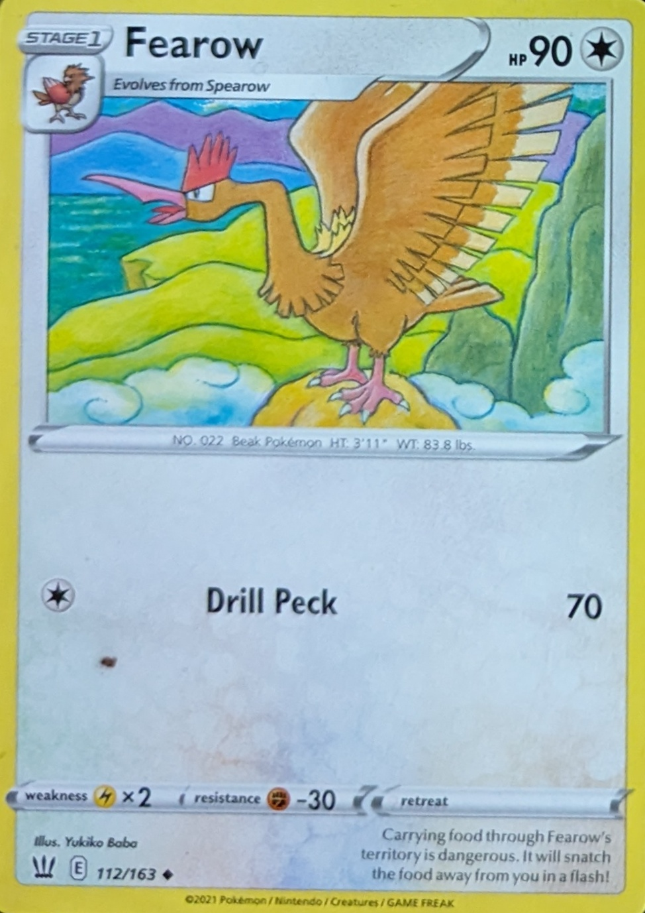

# Card Scanner
### A card scanner built in Python using OpenCV
### Here are some examples of images before and after scan:
<br>



<br>

<br>


<br>
<br>


### Usage
```
python main.py (--images <IMG_DIR> | --image <IMG_PATH>) [-i]
```
* to scan a image:
```
python main.py --image sample/2.jpg
```
* Alternatively, to scan all images in a directory without any input:
```
python main.py --images sample
